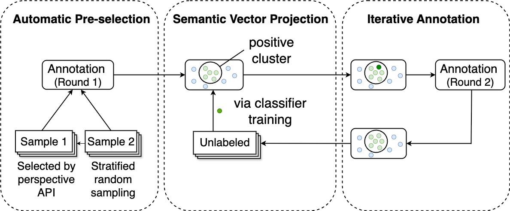

# Multidimensional Political Incivility Detection 

This repository provides machine learning classifiers for detecting **four dimensions of political incivility** in Portuguese-language social media discourse. The classifiers are trained on a corpus of social media posts produced by politicians, political parties, and media outlets during the 2022 Brazilian presidential election. We use logistic regression models as classification heads on top of sentence embeddings generated by the `paraphrase-multilingual-mpnet-base-v2` model.

---

## 🔬 Dimensions of Incivility

| Label     | Description                                  |
|-----------|----------------------------------------------|
| `IMP`     | Impoliteness                                 |
| `PHAVPR`  | Physical harm & violent political rhetoric   |
| `HSST`    | Hate speech and stereotyping                 |
| `THREAT`  | Threats to democratic institutions and values|

---

## 🧠 Methodology

Our classifier was developed using an active learning strategy. The annotation pipeline addresses class imbalance and data scarcity through:

  
*Active learning workflow for classifier training*

Full methodological details are available in our ICWSM 2025 paper: `Quantifying the Spread of Online Incivility in Brazilian Politics` (coming soon).

> The Brazilian classifier is a collaborative effort as part of a Swiss National Science Foundation (SNSF) project: `From Uncivil Disagreement to Political Unrest? A Cross-Platform & Cross-National Analysis of the Offline Consequences of Online Incivility`. Classifiers for other countries and languages will be updated in the future. 

---

## ⚙️ Application

1. **Clone the repository**:
   ```bash
   git clone https://github.com/yuanzhang1227/multidimensional-incivility-detection.git
   cd multidimensional-incivility-detection
2. **Install dependencies**:
   ```bash
   pip install -r requirements.txt
3. **Run the detection script**:
   python `example_run`.py --input `example_input`.csv
   Replace `example_input.csv` with the path to your own data file.
4. **Output file**:
The script generates an output file named `Prediction_Multidimensional_Incivility.csv`, which includes:
- Class predictions
- Probability scores
